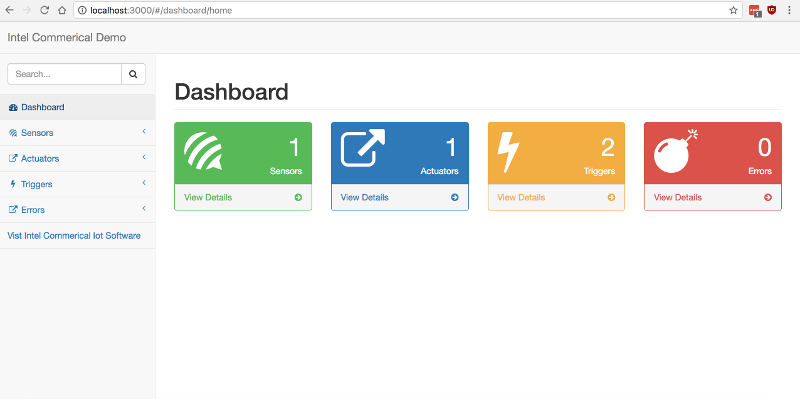
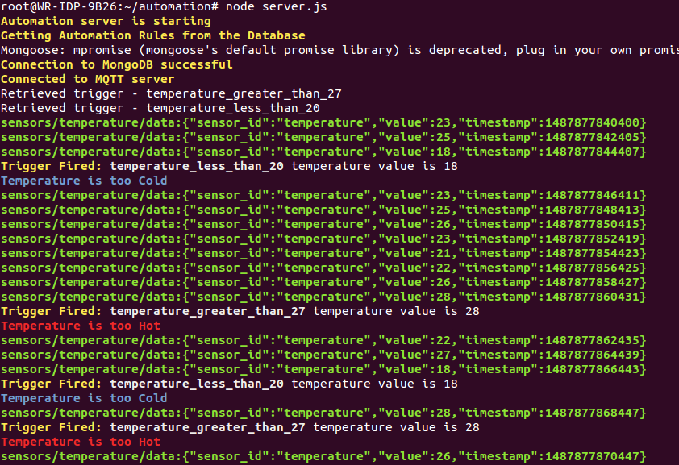

# Automation

## Read the Objectives

By the end of this module, you should be able to:

*   Implement your automation rules in the form of conditional actions called triggers that run on the edge network.
*   Read triggers from the database and evaluate whether any of them should be executed.
*   Write your own Automation Service

### Prerequisites

**You must also initialize the database with a couple of sensors and automation rules.** The instructions for this are in the [Administration Lab](https://github.com/SSG-DRD-IOT/lab-admin-interface).

**You must also ensure that the Mongo database service is running and install the [custom administration web application](https://github.com/SSG-DRD-IOT/lab-admin-interface).**

The Sample administration interface looks like this.


### Read the Introduction

In this lab, we will walk you through building a NodeJS application that implements an automation service for a network.

_Condition Based Monitoring_, sometimes also called _Edge Device Management_, or _Edge Network Automation_, is the idea that edge sensors and actuators should **not be responsible** for decision making or coordinating the responses to various edge network condition. However, neither should all of this decision making and analytics processing be performed in the cloud. The IoT Gateway should be remotely programmable by an IoT administrator or software developer in such a way that **local events** can be **automatically managed and reported**. Intelligent closed loop systems are able to coordinate responses to conditions on their own networks and report back to the cloud or a network operation center.

In the example of a temperature controlled room, the temperature sensor is reporting the temperature to the Intel® IoT Gateway and the gateway is responsible for triggering an IoT event. An IoT Event (also called a trigger in this workshop) always has a conditions function and a trigger function. In the case that the temperature is too hot the event may take automatic action to turn on the air conditioning on and send an alert to the person responsible for the room.

### Read the Steps in the Automation Lab

In this lab, we will:

*   Write several triggers. Develop an understanding of a condition/predicate function. Develop an understanding of trigger functions and their capabilities.

*   Create a NodeJS server that listens to all sensor based data

*   Reads in the triggers from the MongoDB. We will store the triggers in the Mongo database so that they can be remotely added from the administration interface.

*   Compare sensor data to the condition function of each trigger.

*   If a comparison function evaluates to true then execute the trigger function.

## Practice writing conditional predicates for triggers

**A conditional predicate function always returns a true or false value.** It has access to all of the sensor data on the edge network.

For example in JavaScript a predicate function that tests if the temperature is greater than 27 looks like this:

``` js
// The trigger condition function is a predicate function which returns a TRUE or FALSE.
(
  function( temperature ) {
    return temperature > 27;
  }
)
```

Notice the <span style="font-weight:bold">parathesis</span> that surround this function. These are required for the trigger to run correctly. In JavaScript, these parathesis create a block of executable code called a **closure**. The JavaScript interpreter requires this in order to dynamically evaluate the code.

### The previous value for each sensor is stored in the stash array

Later in this lab, we will implement an associative array called the **stash** that contains the last value of each of the sensors on the edge network. Let's build some triggers using the stash now.

### Read the predicate function for the light sensor

#### More Examples:

Write a predicate function that tests if a light sensor has a value less than or equal 15 lumens.

``` js
(
  function( brightness ) {
    return brightness <= 15;
  }
)
```

In our Automation Service, we will also implement the notion of a "stash". The current value will be passed into the function as an argument, but the next most recent value will be stored in the stash. This will allow us to make comparisons between the current value and the previously most recent value.

Write a predicate function that tests of a light sensor has a value greater than 15 lumens and temperature is greater than 27.


``` js
(
    function( light_temperature ) {
      return (stash["light"] > 15 && stash[“temperature”] >= 27;
    }
)
```


### Understand the idea of trigger functions and complete the excercises

A trigger function is a function that is activated when the predicate function is true. Trigger functions have access to all of the sensor data on the edge network, as well as, all of the actuators on the network.

This is an example of a function that is activated when a predicate function returns that it is too cold. First, publish an alert to the rest of the edge network. Restful HTTP requests are used to trigger the actuators on the edge network. In the example here the actuator is a heater that is turned on when it is too cold.


``` js
(
  temperature_too_cold = function() {
    var alert = {
      alert: "Cold"
    };
    self.mqttClient.publish('sensors/temperature/alerts', JSON.stringify(alert) );

    this.http.get('http://heater:10010/action?deviceId=heater&action=on', function (err, res) {
      if (err) {
        console.log("Unable to turn light on");
        console.log(err);
      }
    });
  };
 )

 ```


##### Exercises

1.  Write a function that changes the LCD backlight to blue and and LCD text to "Warning, too cold!"

2.  Write a function that saves an error condition to the database.

### Create the Project Directory and package.json file

Create a new directory for the automation server and initialze a NodeJS application.
``` sh
mkdir automation; cd automation; npm init
```
### Dependencies

This lab depends on the following modules add them to your package.json <span class="icon file">package.json</span>

Next add the dependencies to your project.

``` sh
npm install intel-commercial-edge-network-database-models lodash mongoose
mqtt request request-promise chalk --save
```

Your package.json file's dependencies section should look like this.


``` js
"dependencies": {
  "intel-commercial-edge-network-database-models": "latest",
  "lodash": "latest",
  "chalk": "latest",
  "mongoose": "latest",
  "mqtt": "latest",
  "request": "latest",
  "request-promise": "latest"
}
```


### Server Configuration File

Create a file named <span class="icon file">config.json</span>

Use the following configuration to allow us to change the locations of the MQTT and MongoDB servers:


``` js
{
   "mqtt":{
      "url":"mqtt://localhost"
   },
   "mongodb":{
      "url":"mongodb://localhost/iotdemo"
   },
   "tls":{
      "serverKey":"/etc/tls-certs/certs/server.key",
      "serverCrt":"/etc/tls-certs/certs/server.crt",
      "ca_certificates":"/etc/tls-certs/ca_certificates/ca.crt",
      "host":"localhost",
      "port":"8883"
   },
   "debug":{
      "level":{
         "console":"trace",
         "file":"trace"
      }
   },
   "threshold":{
      "temp_high":27,
      "temp_low":20,
      "sound":40,
      "light":700
   }
}
```


### Create the server.js file and require the dependencies

Create a new file named <span class="icon file">server.js</span> and add these lines:


``` js
// Load the application configuration file
var config = require("./config.json")

// Load NodeJS Library to interact with the filesystem
var fs = require('fs');

// A library to colorize console output
var chalk = require('chalk');

// Require MQTT and setup the connection to the broker
var mqtt = require('mqtt');

// Require the MongoDB libraries and connect to the database
var mongoose = require('mongoose');

// A modern JavaScript utility library delivering modularity, performance & extras.
var _ = require("lodash");

// A simplified HTTP request client with Promise support.
// The request-promise library will be passed to the context Object
// and made available in the triggers.
var http = require('request-promise');

// Write startup message to the console
console.log(chalk.bold.yellow("Automation server is starting"));
```


### Setup the MQTT connection

Be sure to setup a connection to both the MQTT broker and Mongoose DB.


``` js
// Read in the server key and cert and the CA certs
try {
  var KEY = fs.readFileSync(config.tls.serverKey);
  var CERT = fs.readFileSync(config.tls.serverCrt);
  var TRUSTED_CA_LIST = [fs.readFileSync(config.tls.ca_certificates)];
} catch (err) {
  console.error(chalk.bold.red("Unable to find the TLS certs. Please see the first section of the security lab for instructions on creating TLS keys and certificates"))
  console.error(err)
  process.exit()
}

// options - an object to initialize the TLS connection settings
var options = {
  port: config.tls.port,
  host: config.tls.host,
  protocol: 'mqtts',
  protocolId: 'MQIsdp',
  keyPath: KEY,
  certPath: CERT,
  rejectUnauthorized : false,
  //The CA list will be used to determine if server is authorized
  ca: TRUSTED_CA_LIST,
  secureProtocol: 'TLSv1_method',
  protocolVersion: 3
};

// Connect to the MQTT server
var mqttClient  = mqtt.connect(options);
```


### Setup the functions that respond to the MQTT connect and error events

The NodeJS MQTT module starts an event loop that will be the main event loop for the program. We can set callback functions to be called when different event occur. We will attach two callback functions, one function to the "connect" event and another to the “message” event.

The sensor reading is received on the 'sensors/+/data' topic. Remember that the '+' is a wild card character and can stand for 1 or more of any character. Temperature readings would come from the topic 'sensors/temperature/data' and light reading will come from 'sensors/light/data'. Each incoming piece of data has the potential for firing several triggers. For example, if the temperature sensor sends a temperature reading of 28 degress Celsius then it may fire a trigger. Which triggers will might it fire? The trigger must have a sensor_id of "temperature" which indicates that the condition function of this trigger should be evaluated when a temperature reading arrives. If the condition function returns a `true` value then the action function should be run.


``` js
// Define function to respond to the 'connect' event
mqttClient.on('connect', function () {
    console.log(chalk.bold.yellow("Connected to MQTT server"));

    // Subscribe to the MQTT topics
    mqttClient.subscribe('announcements');
    mqttClient.subscribe('sensors/+/data');
});

// Define function to respond to the 'error' event
mqttClient.on('error', function () {
    console.log(chalk.bold.yellow("Unable to connect to MQTT server"));
    process.exit();
});
```


### Setup the functions that respond to the MQTT connect and error events

Next create the code for your MongoDB database connection and create the Trigger and Error objects that will access the trigger and error db collections.


``` js
// Create a connection to the database
  mongoose.connect(config.mongodb.url);
  var db = mongoose.connection;

  // Report database errors to the console
  db.on('error', console.error.bind(console, 'connection error:'));

  // Log when a connection is established to the MongoDB server
  db.once('open', function (callback) {
      console.log(chalk.bold.yellow("Connection to MongoDB successful"));
  });

  // Import the Database Model Objects
  var Trigger = require('intel-commercial-edge-network-database-models').Trigger;
  var Error = require('intel-commercial-edge-network-database-models').Error;
```


### Set Up a Context Object for the Triggers

When the Condition Based Monitoring System evaluates a trigger's condition and action functions, it runs them in a context that we can define.

This context object is passed into the function that evaluates the trigger's conditional and action function. Any JavaScript Array or object stored in the context below will be accessable in the triggers' functions through the "this" object. For example, if you add `http` to the context below it will be accessible through `this.http` in the trigger.

Let's define the context object and add a couple of items to it. First, we will define two arrays. One array will hold all of the triggers and the second will be treated as an associative array and hold the name of the each sensor and its last published value.

The stash array will be made available to all trigger condition functions and trigger functions. This make the stash very important because it’s used in all IoT Event triggers as the method of accessing the temperature sensors and any other sensors that are available on the network.


``` js
// Context - An object that will be passed into each trigger condition and action
//           function.  If you want to use a library in your automation rules,
//           for example MQTT, then put it in the context object.
var context = {
    // Holds the trigger conditions and
     triggers : [],

    // Holds the last value of each sensor and makes the value available
    // to the conditions and functions
    stash : [],

    // Make the HTTP request-promise library available in automation rules
    http: http,

    // Make the MQTT library available in automation rules
    mqttClient: mqttClient,

    // Make the Chalk library available in automation rules
    chalk: chalk
};
```


### Retrieve the Triggers from the Database

Let's implement a function to retrieve all of the triggers from the database. Here, we are using MongooseJS to access the database. The find function takes a callback as an argument if there is an error the err argument will have a value.

If you are interested in the `then` function. This is called a promise in JavaScript. The Promise object is used for deferred and asynchronous computations. A Promise represents an operation that hasn't completed yet, but is expected in the future. Allowing the developer to write asynchronous code in a more synchronous fashion

You can read more able Promise in an article entitled [JavaScript Promises: There and Back Agin](http://www.html5rocks.com/en/tutorials/es6/promises/) by Jake Archibald.


``` js
// Fetch the Automation Rules from the Database
 console.log(chalk.bold.yellow("Getting Automation Rules from the Database"));

 // When the server starts, it should read the triggers from the db and store
 // them the triggers array.

 // Define the function that reads automation rules from the database
 var retrieveTriggersFromDB = function() {
     Trigger
         .find().
         exec().then(function(triggersDB) {
             context.triggers = triggersDB;
             _.forEach(context.triggers,
                       function(trigger) {
                           console.log("Retrieved trigger - " + trigger.name);
                       });
         });
 };

 // Reads automation rules from the database once when the server starts
 retrieveTriggersFromDB();
```


Notice that we call the function as soon as it is defined. When the Conditional Based Monitoring system starts this will read the triggers from the database.

### Start the MQTT Event Loop

When a message is received then parse it and determine if it is a new sensor or if it is new sensor data.


``` js
// Every time a new message is received, do the following
mqttClient.on('message', function (topic, message) {
    console.log(chalk.bold.green(topic + ":" + message.toString()));
    var json;

    // Parse incoming JSON and print an error if JSON is bad
    try {
        json = JSON.parse(message);
    } catch(error) {
        console.log("Malformated JSON received: " + message);
    }

    // If a sensor datum arrives on a MQTT topic then process it.
    if (isSensorTopic(topic)) {
        processSensorData(json);
    }
});
```


### Define Helper Functions

### Define a few Helper Functions

Before we define the on message function, let's define a couple of helper functions. These will make our code a bit easier to read. The first two function match the `topic` on the incoming MQTT messages. The third function takes an array for triggers and returns an array with all of the triggers that have a sensor_id that matches the sensor_id that we pass into the function. This will be useful because when a sensor reading arrives it can only fire a trigger that has a sensor_id matching the data.


``` js
// filter_triggers_by_sensor_id - Takes an array of automation rules and returns
// and returns an array of automation rules that apply to a particular sensor.
var filter_triggers_by_sensor_id = function(id) {
    return _.filter(context.triggers, {sensor_id : id});
};

// filter_triggers_by_active - Takes an array of automation rules and returns
// and returns an array of automation rules that are set to active.
var filter_triggers_by_active= function(id) {
    return _.filter(context.triggers, {active : true});
};

// Predicate to determine if the message is from a sensors/<sensor_id>/data topic
var isSensorTopic = function(str) {
    return str.match(/sensors\/[A-Za-z0-9]{0,32}\/data/);
}
```


### Trigger Each Rule that Applies to a Particular Incoming Sensor Data


``` js
// processSensorData - a function that receives a sensor datum in json format
// and filters the automation rules by the sensor that the datum came from.
// It then call the automation rules condition function. If the condition
// function is TRUE, it call the eval_triggerFunc which performs the automation
// action. This function also stores the datum in the stash. If the stash had a
// previous value then it will be overwritten.
var processSensorData = function(json) {
    var sensor_id = json.sensor_id;
    var value = json.value;

    // Loop through all of the triggers for the sensor which
    // is sending this incoming sensor data.
    context.stash[sensor_id] = value;

    // Filter the automation filter rules by sensor and whether it is active
    // then pass each rule to a functions that checks the trigger predicate function
    // and call the action function if it is TRUE
    _.forEach(
        filter_triggers_by_active(
          filter_triggers_by_sensor_id(
            sensor_id
        )),

        // Check if the triggers predicate evaluates to true
        function(trigger) {
            // If a trigger is malformatted then log the error
            try {
                // Pass the context object into the evaluation of condition and action
                if (trigger.eval_condition(context, json)) {
                    console.log(chalk.bold.yellow("Trigger Fired: ") + chalk.bold.white(trigger.name) + " temperature value is " + value);
                    trigger.eval_triggerFunc(context, json);
                }
            } catch (err) {
                console.log(chalk.bold.red(err));
            }
        });

    // After the trigger is run the value used becomes the previous value
    context.stash[sensor_id+"_prev"] = value;
};
```


### Run the automation server and verify the Triggers



Before we run the automation server make sure that sensors are publishing the topic **sensors/temperature/data**. As described in earlier labs one way is to run the virtual-sensor.js with --tls option in another SSH terminal of Gateway

Execute the automation <span class="icon file">server.js</span> that we created

    $ node server.js

You should start seeing the sensor topic messages from the traces. You should also notice the triggers getting fired for the conditions that we have set as shown in the figure

### Download the Solution to this Lab from Github

On your Up2 Board, run the following commands.

`$ git clone https://github.com/SSG-DRD-IOT/lab-automation`  
`$ cd lab-automation`  
`$ npm install`  
`$ node server.js`
